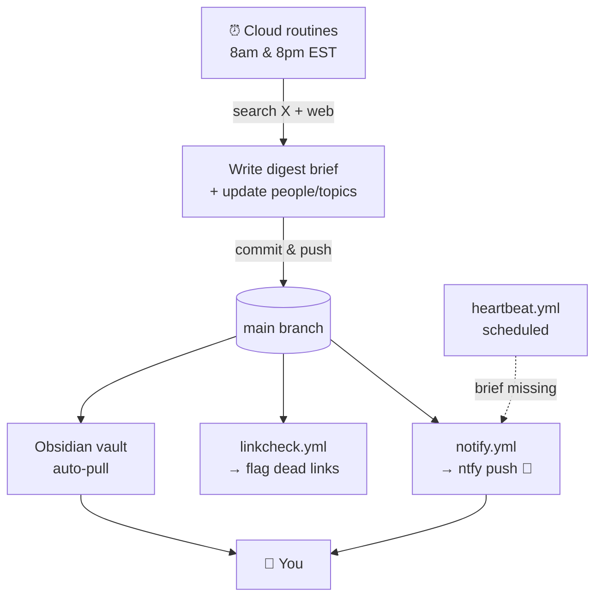

# ai-intel

A **self-writing AI intel wiki**: a living knowledge base about the people,
projects, and ideas moving the AI world. Two scheduled cloud agents read what
happened across X and the web twice a day, write a short brief, update the
relevant people/topic pages, push to `main`, and ping your phone. It's built to
be browsed as an [Obsidian](https://obsidian.md) vault.

## How it works



Each run:
1. Reads `people/` and `topics/` as the **source of truth** for what to track.
2. Searches X/Twitter and the web for the last ~10h.
3. Writes a scannable digest to `briefs/<date>-<session>.md` — TL;DR, light
   section headers, one-line bullets, every bullet ending in a real source link.
4. Appends dated, sourced notes to the relevant `people/` and `topics/` pages.
5. Commits and pushes directly to `main`.

The writing uses an in-repo "humanizer" skill so briefs don't read machine-generated.

## Folder structure

```
.claude/skills/humanizer/   Skill the routines use to clean up writing
.github/workflows/          notify.yml · linkcheck.yml · heartbeat.yml
briefs/                     Dated digests: YYYY-MM-DD-{morning,evening}.md
people/                     One page per tracked person (name, handle, tags:[person])
topics/                     One page per topic (title, tags:[topic])
Dashboard.md                Dataview home note (recent briefs, top people/topics)
README.md                   This file
```

- **`people/` is the whitelist.** Add a `people/<slug>.md` with `name`, `handle`,
  `tags: [person]` and the next run tracks them. Remove the file to stop. The
  filename (no `.md`) is the wikilink slug, e.g. `[[karpathy]]`.
- **`topics/`** works the same way for themes; its filenames are the topic slugs.

## Automation

- **Routines** (claude.ai/code): two scheduled agents, **8:00 AM** and **8:00 PM
  EST**. Manage at https://claude.ai/code/routines.
- **`notify.yml`** — on each new brief, sends an [ntfy.sh](https://ntfy.sh) push
  (topic `ai-intel`) with a one-line summary + link; tap opens the brief.
  Subscribe in the ntfy app to topic `ai-intel`.
- **`linkcheck.yml`** — verifies the brief's source links resolve; alerts on
  dead/invented ones (404/410/unreachable).
- **`heartbeat.yml`** — shortly after each window, alerts if the expected brief
  never landed, so a failed run can't pass as a quiet day.

## Using it in Obsidian

Open the repo root as a vault (`Open folder as vault`). You get wikilinks,
backlinks (each person/topic page shows every brief that mentioned it), the graph
view, and tag filtering (`person` / `topic` / `brief`).

- Install the **Dataview** plugin to make `Dashboard.md` render.
- Install the **Obsidian Git** plugin and enable auto-pull so new briefs sync to
  your vault automatically (the routines push to GitHub, not to your machine).

## A note on accuracy

Briefs are auto-generated from web search. The link-check catches dead URLs, but
it can't verify that every claim is true — treat briefs as leads, not gospel, and
follow the sources.
