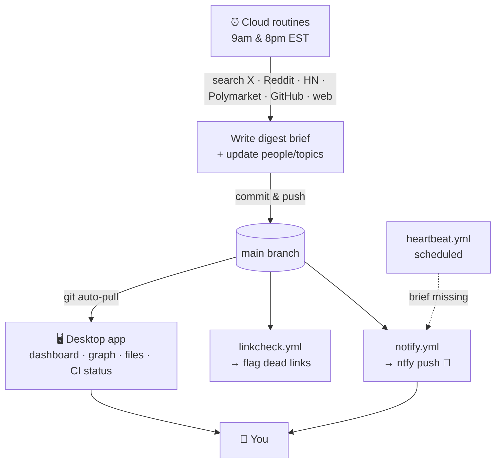

# ai-intel

A **self-writing AI intel wiki**: a living knowledge base about the people,
projects, and ideas moving the AI world. Two scheduled cloud agents read what
happened across X, Reddit, Hacker News, Polymarket, GitHub, and the web twice a
day, write a short brief, update the relevant people/topic pages, push to `main`,
and ping your phone. It's built to be browsed as an [Obsidian](https://obsidian.md) vault.

## How it works



Each run:
1. Reads `people/`, `companies/`, and `topics/` as the **source of truth** for what to track.
2. Searches across multiple sources for the last ~10h:
   - **X/Twitter** and the **web** via search
   - **Reddit** — pulled as structured JSON (`r/<sub>/new.json`, filtered by `created_utc`)
     across 26+ practitioner subs (r/LocalLLaMA, r/ClaudeAI, r/OpenAI, etc.)
   - **Hacker News** — via the Algolia API (`hn.algolia.com`), filtered by freshness and
     minimum engagement (≥10 points or ≥5 comments)
   - **Polymarket** — scans active prediction markets for AI topics; surfaces a signal only
     if volume > $10k and the odds are surprising or actionable
   - **GitHub trending** — daily trending repos, filtered to AI/ML/agent projects
   - **TLDR newsletters** (morning only) — ai, tech, and hardware editions
3. Ranks competing items by community engagement (Reddit score, HN points, comment count)
   within the freshness window.
4. Skims the previous brief and reports only what's new since then, so the morning and
   evening briefs don't repeat each other.
5. Writes a scannable digest to `briefs/<date>-<session>.md` — TL;DR, light section
   headers, one-line bullets in a plain voice, every bullet ending in a real source link.
6. Appends dated, sourced notes to the relevant `people/`, `companies/`, and `topics/` pages.
7. Commits and pushes the brief to `main` first, then the page updates as a second commit.

## Folder structure

```
.claude/skills/humanizer/   Bundled MIT writing-cleanup skill (optional; not in the default pipeline)
.github/workflows/          notify.yml · linkcheck.yml · heartbeat.yml
briefs/                     Dated digests: YYYY-MM-DD-{morning,evening}.md
people/                     One page per tracked person (name, handle, tags:[person])
companies/                  One page per tracked public company (name, ticker, layer, tags:[company])
topics/                     One page per topic (title, tags:[topic])
app/                        Desktop reader app (Electron: dashboard, graph, files)
README.md                   This file
```

- **`people/` is the whitelist.** Add a `people/<slug>.md` with `name`, `handle`,
  `tags: [person]` and the next run tracks them. Remove the file to stop. The
  filename (no `.md`) is the wikilink slug, e.g. `[[karpathy]]`. Each page carries a
  short bio and links the handle to that person's X profile; the routine appends dated,
  sourced notes under `## Recent`.
- **`companies/`** works the same way for public companies across the AI hardware/datacenter
  supply chain -- compute, memory, networking, storage, power, cooling, and building & site
  (see [[ai-datacenter-stack]]) -- plus the TMT names around them. Add a `companies/<slug>.md`
  with `name`, `ticker`, `layer`, `tags: [company]`; the routine tracks stock-moving news
  (earnings, capex guidance, supply agreements) alongside product news, same as people/.
- **`topics/`** works the same way for themes; its filenames are the topic slugs.

## Automation

- **Routines** (claude.ai/code): two scheduled agents, **8:00 AM** and **8:00 PM
  EST**. Manage at https://claude.ai/code/routines.
- **`notify.yml`** — on each new brief, sends an [ntfy.sh](https://ntfy.sh) push
  (topic `ai-intel`) with a one-line summary + link; tap opens the brief.
  Subscribe in the ntfy app to topic `ai-intel`.
- **`linkcheck.yml`** — verifies the brief's source links resolve; alerts on
  dead/invented ones (404/410/unreachable).
- **`heartbeat.yml`** — shortly after each window, alerts if the expected brief
  never landed, so a failed run can't pass as a quiet day.

## Run your own copy

It's just markdown + GitHub Actions + Claude Code routines, so you can fork it and
point it at your own interests:

1. **Fork the repo**, then edit `people/` and `topics/` to track who and what you
   care about (one file each — see [Folder structure](#folder-structure)).
2. **Create two Claude Code routines** at
   [claude.ai/code/routines](https://claude.ai/code/routines) — a morning and an
   evening run — pointed at your fork. Each routine's prompt scans X, Reddit (via the
   public `.json` endpoints, filtered by `created_utc`), Hacker News (Algolia API),
   Polymarket, GitHub trending, and the web for your tracked people/topics, writes
   `briefs/<date>-<session>.md`, updates the stubs, and commits/pushes to `main`.
   (The prompts live in claude.ai, not the repo; cron is in UTC, so convert from your timezone.)
3. **Allow direct pushes** — in the routine's repo permissions, enable
   **Allow unrestricted git push** so it can commit straight to `main` (or adapt
   the prompt to open PRs instead).
4. **Choose an ntfy topic** — replace `ai-intel` with your own (ideally
   unguessable) topic in `.github/workflows/notify.yml` and `heartbeat.yml`, then
   subscribe to it in the [ntfy](https://ntfy.sh) app.
5. **Enable GitHub Actions** on your fork (they power notifications, link-checking,
   and the missed-run heartbeat). No secrets or tokens needed — ntfy topics are
   public and the workflows just `curl` them.
6. **(Optional) the desktop app** — `cd app && npm install && npm start`. Its CI
   panel uses the [GitHub CLI](https://cli.github.com) (`gh auth login`).

## Desktop app

A standalone Electron reader lives in [`app/`](app/) — a purpose-built mini-Obsidian for
this vault, so you don't need Obsidian at all. Three views over the same markdown:

- **Dashboard** — next-run time, stats, recent briefs, the latest brief rendered inline,
  and a live status panel: whether you're behind `origin` (click to pull) and the latest
  GitHub Actions run for each workflow (notify · link-check · heartbeat, via the `gh` CLI).
- **Graph** — force-directed map of briefs ↔ people ↔ topics, from frontmatter + `[[wikilinks]]`.
- **Files** — a collapsible file tree of the vault + a reader.

It auto-pulls from GitHub (every 10 min + on launch) and live-reloads on file changes, so
new briefs appear on their own.

```bash
cd app && npm install && npm start   # run from source
npm run dist                          # build a macOS .app + .dmg into app/dist/
```

See [`app/README.md`](app/README.md) for details.

## Obsidian (optional)

The desktop app above is the primary way to read this wiki, but since it's just a
folder of markdown, you can also open it in [Obsidian](https://obsidian.md) if you
prefer (`Open folder as vault`, pointed at the repo root). You get wikilinks,
backlinks (each person/topic page shows every brief that mentioned it), the graph
view, and tag filtering (`person` / `topic` / `brief`).

If you go the Obsidian route, install the **Obsidian Git** plugin and enable
auto-pull so new briefs sync to your vault (the routines push to GitHub, not to
your machine).

## A note on accuracy

Briefs are auto-generated from web search. The link-check catches dead URLs, but
it can't verify that every claim is true — treat briefs as leads, not gospel, and
follow the sources.

## License

MIT — see [LICENSE](LICENSE). The bundled humanizer skill is MIT, adapted from
[blader/humanizer](https://github.com/blader/humanizer).
